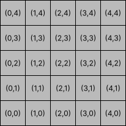

# Robot Coding Challenge
This is a programming challenge based on [this spec](20_coding_test.md).
## Building
To build in a docker container, use an image with the .Net SDK and CLI installed, like this one: [dotnet/sdk](https://hub.docker.com/_/microsoft-dotnet-sdk/).

To get to a shell prompt, you can run:

```
docker run -it mcr.microsoft.com/dotnet/sdk bash
```

Once at a shell prompt:

```
cd /home/app
git clone https://github.com/natvincent/RobotChallenge.git
cd RobotChallenge
dotnet build
```
To run the unit tests:
```
dotnet test
```

## Running the Robot

Running the robot from the command line directly (from the RobotChallenge directory):
```
dotnet run
```
You will be presented with an empty command line. Valid commands are listed in the [spec](20_coding_test.md).

The challenge is to create a program to simulate a robot on a table top. The robot can be given commands that allow it to move around on the table.

* The tabletop that is divided into a grid 5 squares across (East and West) and 5 squares high (North and South).
* The South Western corner is ```0,0```.
* The robot can be issued commands at the command line. 
* Commands allow the robot to be placed on the table, moved forward and rotated left or right.
* Invalid commands are ignored.
* All commands are ignored until the ```PLACE``` command is used to put the robot on the table.

Commands can be passed to the program via ```stdin``` and output can be piped from ```stdout```. e.g.:

```
Robotc < Commands.txt > Output.txt
```

There are example command files included in the ```Robotc\TestData``` folder.

### Table Top


### Valid Commands
|Command|Parameters|Description|
|--------|----------------|------|
|```PLACE```||Place a robot on the table. Commands (other than ```EXIT```) are ignored until this command is issued.|
||```X```|Integer between 0 and 4.|
||```Y```|Integer between 0 and 4.|
||```Heading```|One of ```NORTH```, ```SOUTH```, ```EAST``` or ```WEST```. The direction the robot is to face.|
|```MOVE```|None|Move one square forward in the direction the robot is facing. If the robot is at the boundary of the table it will not move forward.|
|```LEFT```|None|Rotate the robot to the left 90°.|
|```RIGHT```|None|Rotate the robot to the right 90°.|
|```REPORT```|None|Output the robots position to ```stdout```.|
|```EXIT```|None|Exits the program. CTRL+C and CTRL+Z can also be used to exit. When passing in commands from a file via ```stdin```, the EXIT command is not required to exit the program|

## Design Assumptions and Thoughts (from before development)
### I/O
- Need to handle input from StdIn, output to StdOut. 
  - This allows input from console or from a file. 
  - Allows for easier integration testing
- Use stdin read line initially, although this may have to be rethought to handle very long input lines that could bork the input handling
- It's worthwhile abstracting the input and output handling as I/O could be changed abitrarily e.g. JSON in, HTML out
### Commands
- Bail out as early as possible when parsing commands
  - Naive approch is to delimit on space for command then by comma for parameters (simplest thing that works). 
  - Eventual robust/performant handling of commands should be done with the knowledge of the longest possible string for command name and arguments (including the command itself).
  - Regex will work for this. If it's not performant, a hand coded parser *might* be needed, but only if profiling shows that's the slow part.
- Initial thoughts were that commands should be objects created for each command string from a factory based on the command name.
  - But on thinking, using something like the strategy pattern is probably more performant.
  - Create commands on startup and add them to a list or dictionary.
  - List item should contain action method and regex for parameters
  - Given the small number of commands, an in-order array lookup is reasonable to start with (rather than an expensive dictionary).
- Command function should take parameters, Table Top and Robot
## Inital Design
### Command Dispatcher 
- Depends on Table Top and Robot Factory.
- Robot is initially either null or null object. Maybe have a `IsRobotPlaced()` method
- Bail early in command processing if `IsRobotPlaced()` is `false`.
### Table Top
- Assume that a table top can be started with any size, or can be resized during session.
  - What happens if existing robot location is invalid after table top size has changed? 
- One method to test if a move-to location is valid - `CanMoveTo()`.
  - Initially just checks the bounds
  - Can be extended to check for obstacles. 
### Robot
- Keeps track of it's own location and heading

## Possible Extentions in Timed Challenge
- Table top size specified on command line.
- Obstacals
### Commands
- Change table top size - TABLE *width,height*
- Diagonal headings.
- MOVE *squares*
- MOVETO *x,y*
  - Maybe a metacommand that generates subcommands? A bit of path finding?
- REPORT robot location as an ASCII grid, markdown or HTML table, JSON.
- Input via JSON.
- Make it a web service?